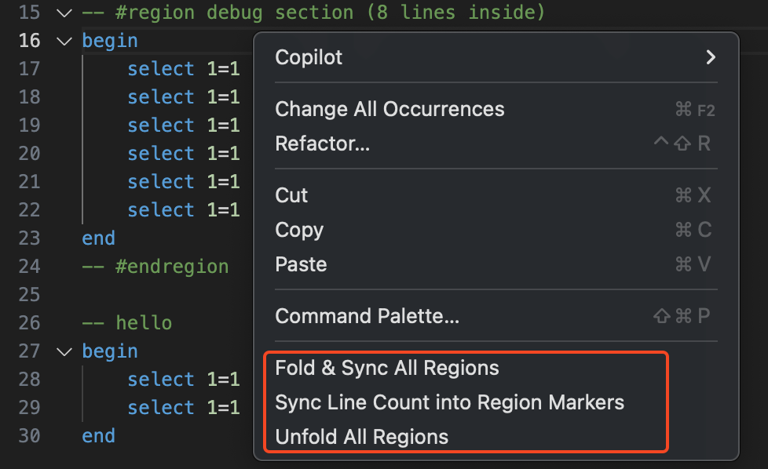
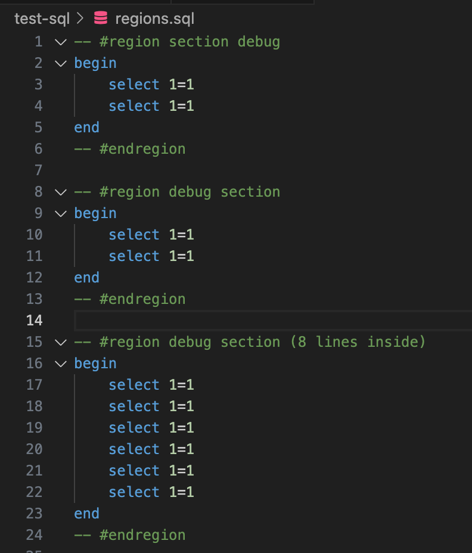
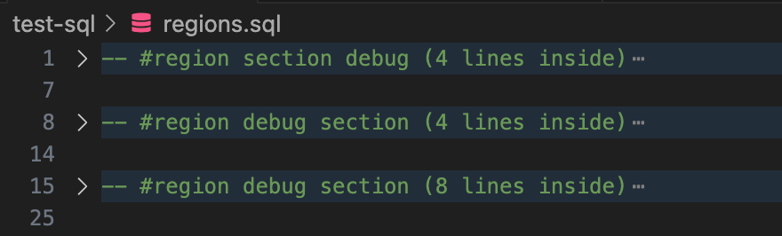

# Region Folding Utilities

#### Version française disponible ici : [README_FR.md](README_FR.md)

A VS Code extension to enhance region management in SQL files with folding and line counting utilities.


## 🚀 Features

This extension provides practical tools to manage code regions in your SQL files:

- **🔄 Fold & Sync All Regions**: Automatically updates line count in all regions and folds them
- **➕ Sync Line Count into Region Markers**: Adds or updates line count in region markers
- **📂 Unfold All Regions**: Unfolds all regions in the file
- **🖱️ Context menu**: Quick access to all commands via right-click

## 📋 Prerequisites

- VS Code version 1.102.0 or higher
- SQL files (currently, only SQL files are supported)

## 🛠️ Installation

### Via VS Code Marketplace
1. Open VS Code
2. Go to Extensions (`Ctrl+Shift+X`)
3. Search for "Region Folding Utilities"
4. Click "Install"

### Manual Installation
1. Download the `.vsix` file from [releases](https://github.com/jonestremblay/Region-Folding-Utilities/releases)
2. Open VS Code
3. Go to Extensions (`Ctrl+Shift+X`)
4. Click the three dots (...) and select "Install from VSIX..."
5. Select the downloaded file

## 📖 Usage

### SQL Region Format

The extension recognizes SQL regions in the following format:

```sql
-- #region Region name
SELECT * FROM table1;
SELECT * FROM table2;
-- #endregion
```

After using the "Sync Line Count into Region Markers" command, this becomes:

```sql
-- #region Region name (2 lines inside)
SELECT * FROM table1;
SELECT * FROM table2;
-- #endregion
```

### Available Commands

#### 🔄 Fold & Sync All Regions
Updates line count in all regions and folds them automatically.

**Access:**
- Command Palette: `Ctrl+Shift+P` → "Fold & Sync All Regions"
- Context menu: Right-click in an SQL file

#### ➕ Sync Line Count into Region Markers
Adds or updates line count between `#region` and `#endregion` markers.

**Access:**
- Command Palette: `Ctrl+Shift+P` → "Sync Line Count into Region Markers"
- Context menu: Right-click in an SQL file

#### 📂 Unfold All Regions
Unfolds all regions in the active file.

**Access:**
- Command Palette: `Ctrl+Shift+P` → "Unfold All Regions"
- Context menu: Right-click in an SQL file

## 📸 Screenshots

### Context menu


### Unfolded code


### Folded code with line count


## ⚙️ Configuration

No special configuration is required. The extension works automatically with SQL files.

## 🐛 Known Issues

- Currently limited to SQL files only
- Regions must follow the exact format `-- #region` and `-- #endregion`

## 🤝 Contributing

Contributions are welcome! Feel free to:

1. Fork the project
2. Create a feature branch (`git checkout -b feature/AmazingFeature`)
3. Commit your changes (`git commit -m 'Add some AmazingFeature'`)
4. Push to the branch (`git push origin feature/AmazingFeature`)
5. Open a Pull Request

## 📝 License

This project is licensed under the MIT License. See the [LICENSE](LICENSE) file for details.

## 📧 Contact

- **Author:** Jones Tremblay
- **Repository:** [Region-Folding-Utilities](https://github.com/jonestremblay/Region-Folding-Utilities)

## 🗺️ Roadmap

- [ ] Support for other languages (JavaScript, TypeScript, C#, etc.)
- [ ] Customizable region format configuration
- [ ] Configurable keyboard shortcuts
- [ ] Improved automatic region detection

---

⭐ If this extension helps you, don't hesitate to give it a star on GitHub!
