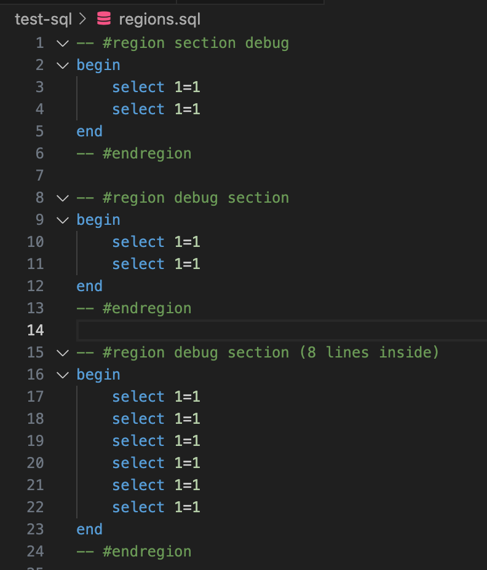
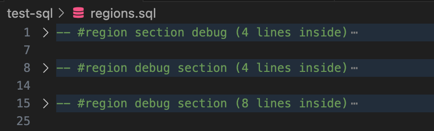

# Region Folding Utilities

#### English version available here : [README.md](README.md)

Une extension VS Code pour améliorer la gestion des régions dans les fichiers avec des utilitaires de pliage et de comptage de lignes.
Note : Les fichiers .txt files ne fonctionnent pas, car ils n'ont pas de syntaxe pour des lignes de commentaires.


## 🚀 Fonctionnalités

Cette extension fournit des outils pratiques pour gérer les régions de code dans vos fichiers SQL :

- **🔄 Fold & Sync All Regions** : Met à jour automatiquement le nombre de lignes dans toutes les régions et les plie
- **➕ Sync Line Count into Region Markers** : Ajoute ou met à jour le nombre de lignes dans les marqueurs de région
- **📂 Unfold All Regions** : Déplie toutes les régions du fichier
- **🖱️ Menu contextuel** : Accès rapide à toutes les commandes via le clic droit

## 🛠️ Installation

### Via VS Code Marketplace
1. Ouvrez VS Code
2. Allez dans Extensions (`Ctrl+Shift+X`)
3. Recherchez "Region Folding Utilities"
4. Cliquez sur "Install"

### Installation manuelle
1. Téléchargez le fichier `.vsix` depuis les [releases](https://github.com/jonestremblay/Region-Folding-Utilities/releases)
2. Ouvrez VS Code
3. Allez dans Extensions (`Ctrl+Shift+X`)
4. Cliquez sur les trois points (...) et sélectionnez "Install from VSIX..."
5. Sélectionnez le fichier téléchargé

## 📖 Utilisation

### Format des régions 

L'extension reconnaît les régions au format suivant :

```sql
-- #region Nom de la région
SELECT * FROM table1;
SELECT * FROM table2;
-- #endregion
```

Après l'utilisation de la commande "Sync Line Count into Region Markers", cela devient :

```sql
-- #region Nom de la région (2 lines inside)
SELECT * FROM table1;
SELECT * FROM table2;
-- #endregion
```

### Commandes disponibles

#### 🔄 Fold & Sync All Regions
Met à jour le nombre de lignes dans toutes les régions et les plie automatiquement.

**Accès :**
- Palette de commandes : `Ctrl+Shift+P` → "Fold & Sync All Regions"
- Menu contextuel : Clic droit dans un fichier SQL

#### ➕ Sync Line Count into Region Markers
Ajoute ou met à jour le nombre de lignes entre les marqueurs `#region` et `#endregion`.

**Accès :**
- Palette de commandes : `Ctrl+Shift+P` → "Sync Line Count into Region Markers"
- Menu contextuel : Clic droit dans un fichier SQL

#### 📂 Unfold All Regions
Déplie toutes les régions du fichier actif.

**Accès :**
- Palette de commandes : `Ctrl+Shift+P` → "Unfold All Regions"
- Menu contextuel : Clic droit dans un fichier SQL

## 📸 Captures d'écran

### Menu contextuel


### Code non plié


### Code plié avec comptage des lignes


## ⚙️ Configuration

Aucune configuration spéciale n'est requise. L'extension fonctionne automatiquement avec les fichiers SQL.

## 🐛 Problèmes connus

- Actuellement limité aux fichiers SQL uniquement
- Les régions doivent suivre le format exact `-- #region` et `-- #endregion`

## 🤝 Contribution

Les contributions sont les bienvenues ! N'hésitez pas à :

1. Fork le projet
2. Créer une branche pour votre fonctionnalité (`git checkout -b feature/AmazingFeature`)
3. Commit vos changements (`git commit -m 'Add some AmazingFeature'`)
4. Push vers la branche (`git push origin feature/AmazingFeature`)
5. Ouvrir une Pull Request

## 📝 Licence

Ce projet est sous licence MIT. Voir le fichier [LICENSE](LICENSE) pour plus de détails.

## 📧 Contact

- **Auteur :** Jones Tremblay
- **Repository :** [Region-Folding-Utilities](https://github.com/jonestremblay/Region-Folding-Utilities)

## 🗺️ Roadmap

- [ ] Support pour d'autres langages (JavaScript, TypeScript, C#, etc.)
- [ ] Configuration personnalisable des formats de région
- [ ] Raccourcis clavier configurables
- [ ] Amélioration de la détection automatique des régions

---

⭐ Si cette extension vous aide, n'hésitez pas à lui donner une étoile sur GitHub !
